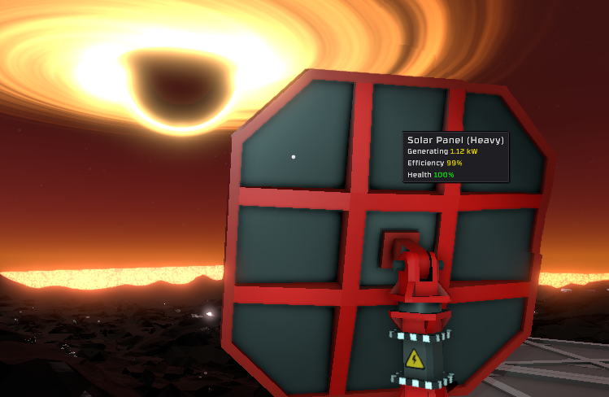
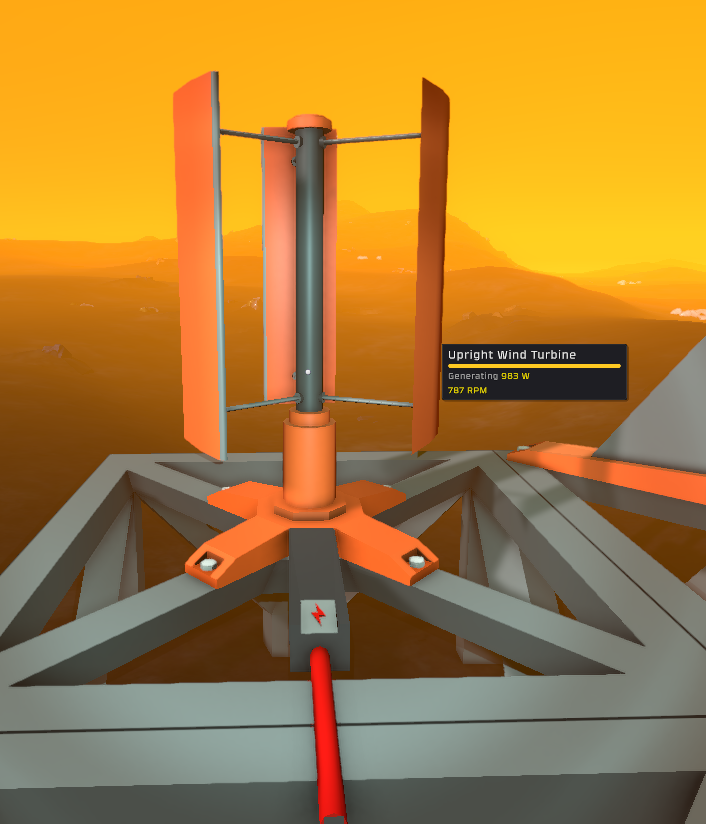
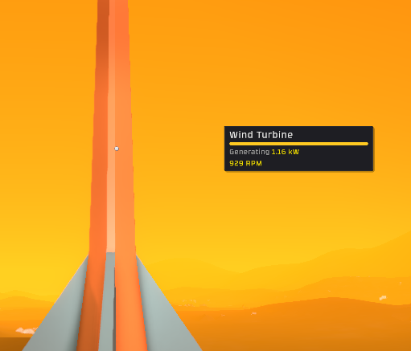

## Downloads [here](https://github.com/TerameTechYT/StationeersSharp/tree/development/Build/x64/Release)

### BetterPowerMod:
> Fixes the max wattage (500w) of solar panels. 
> They are now set to your planets irradiance level, or the max wattage of your cable. 
> Wind turbines now have a higher max output and a new tooltip. 
> Stirling Engines can now generate 20kw like the Gas Fuel Generator. 
> Turbine Generators now generate 10x their original output, now making them a viable power source. 
> Battery Chargers, Power Controllers, and Omni Power Transmitters can now use up to 2,500w at once. 

