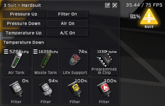

## Downloads [here](https://github.com/TerameTechYT/StationeersSharp/tree/development/Build/x64/Release)

## BetterWasteTank:
### Waste Tank Changes
> Improves the wastetank by making the suit use the full potential of the canisters capacity.   
> Changes heating affect by lowering the amount of waste that goes into the waste tank when cooling the suit by 3 times.   
> The new max pressure of the waste tank is (*TankMaxPressure* - 101)   
> Regular Canister: *(10132.5 - 101)* = **10031.5kpa**  
> Smart Canister: *(20265 - 10)* = **20164kpa**  
> High Volume Canister: *(25331 - 101)* = **25130kpa**  

