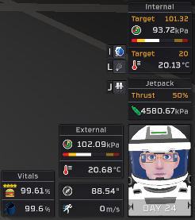
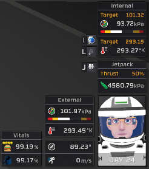
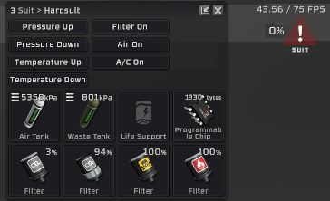
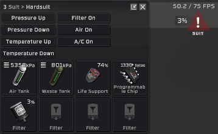

## Downloads [here](https://github.com/TerameTechYT/StationeersSharp/tree/development/Build/x64/Release)

## DetailedPlayerInfo:
### Info Display Changes:

  
> Makes the info windows on the bottom right more informal by untruncating the numbers it displays.  
> You can also quickly enable between viewing celsius and kelvin temperatures by holding "K" ingame.   
> also fixed a small bug with the day counter being "0" when you first enter a world.  

### FPS Counter Features:  
> FPS Text is now "*FPS* / *Cap* FPS"  
> FPS Cap will now actually be set (on caps below 60) and will not render numbers above the cap. 
> FPS Counter is a bit shorter due to removal of latency.  

### Battery and Filter Warning Percentages:

  
> There is now percentages on battery and filter status alerts.  
> You can now close your suit window for less screen clutter!!  