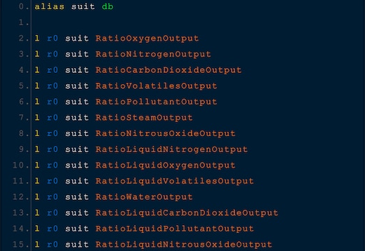

## Downloads [here](https://github.com/TerameTechYT/StationeersSharp/tree/development/Build/x64/Release)

## ExternalSuitReader:
### Advanced Suit Logic Changes:
> Makes the advanced suit have the ability to read the external atmosphere of which the suit is in.  
> RatioOxygenOutput = Oxygen. 
> RatioLiquidOxygenOutput = LiquidOxygen 
> RatioNitrogenOutput = Nitrogen 
> RatioLiquidNitrogenOutput = LiquidNitrogen 
> RatioCarbonDioxideOutput = CarbonDioxide 
> RatioLiquidCarbonDioxideOutput = LiquidCarbonDioxide 
> RatioVolatilesOutput = Volatiles 
> RatioLiquidVolatilesOutput = LiquidVolatiles 
> RatioPollutantOutput = Pollutant 
> RatioLiquidPollutantOutput = LiquidPollutant 
> RatioNitrousOxideOutput = NitrousOxide 
> RatioLiquidNitrousOxideOutput = LiquidNitrousOxide 
> RatioSteamOutput = Steam 
> RatioWaterOutput = Water 
> RatioWaterOutput2 = PollutedWater (there isnt a RatioPollutedWaterOutput for some reason)

