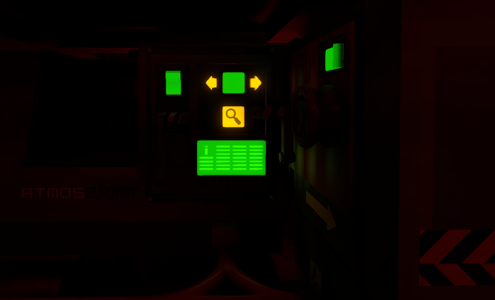
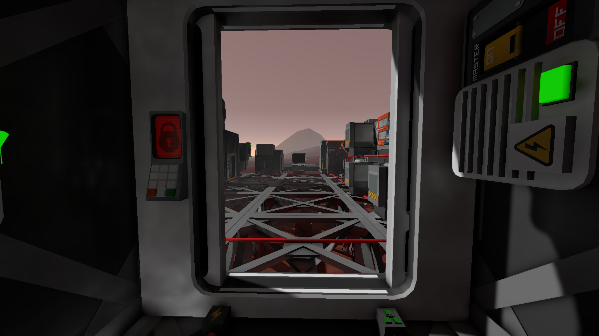
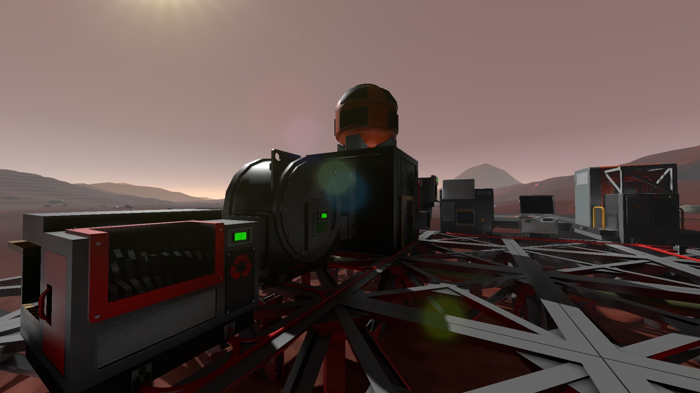

## Downloads [here](https://github.com/TerameTechYT/StationeersSharp/tree/development/Build/x64/Release)

### Sonic Ether Global Illumination (SEGI):
> **Full credits to Erdoy for the original port to Stationeers.Addons!!!** 
> A fully-dynamic voxel-based global illumination system for Stationeers. 
> This is a port of Stationeers.SEGI for Stationeers.Mods.  
> [erdoy Stationeers.SEGI](https://github.com/Erdroy/Stationeers.SEGI/) 
> [sonicether SEGI](https://github.com/sonicether/SEGI) 

 

 

